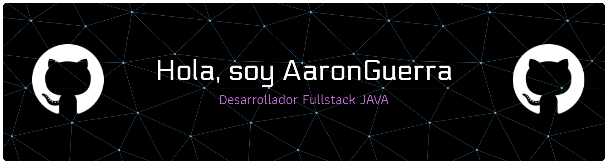
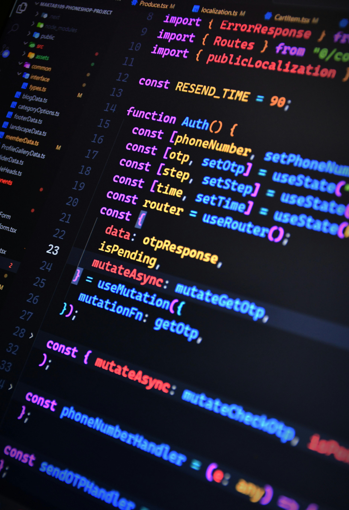

<!-- BANNER PRINCIPAL -->

  

<!-- TÍTULO DINÁMICO (ANIMACIÓN DE ESCRITURA) -->

  

<!-- SECCIÓN INFORMATIVA PRINCIPAL (Estructura en Tabla para evitar líneas fantasma) -->
<table align="center" style="border: none; border-collapse: collapse; background: transparent;">
  <tr style="border: none; background: transparent;">
    <!-- Columna Izquierda: Imagen -->
    <td width="360" valign="top" style="border: none; padding-right: 20px;">
      
    </td>
    <!-- Columna Derecha: Texto -->
    <td valign="top" style="border: none; text-align: left;">
      <h3 style="margin-top: 0;">👋 ¡Hola! Soy Aaron Guerra</h3>
      🚀 Actualmente me estoy formando en el <b>Bootcamp de Generation</b> como desarrollador Full Stack JAVA. 
      🌐 Expandiendo mis horizontes en el mundo del desarrollo web. 
      📚 Técnico en <b>Diseño Gráfico Multimedia</b> con especialidad en Editorial, Gráfica y Audiovisual. 
      📝 Busco fusionar el código y el diseño para crear soluciones web integrales y atractivas. 
      🌟 Mis lenguajes principales: <code>Java</code> y <code>JavaScript</code>. 
      🎵 Melómano apasionado: Rock, power/heavy/progressive metal, blues, jazz sax, gospel, country y cuartetos vocales.
    </td>
  </tr>
</table>

<table align="center" style="border: none; border-collapse: collapse; background: transparent;">
  <tr style="border: none; background: transparent;">
    <td valign="top" style="border: none;">
<!-- SECCIÓN DE STACK TECNOLÓGICO Y HERRAMIENTAS -->
<!-- Al estar totalmente aislada de la sección anterior por la tabla, ya no heredará estilos extraños -->

  🛠️ Mis Herramientas Favoritas

 

  👨‍💻 Lenguajes de Programación y Frontend

  

 

  🗄️ Bases de Datos

  

 

  💻 Software y Flujo de Trabajo

  <a href="https://skillicons.dev">
    
      
    
  </a>

</td>
</tr>
</table>
